Statistical companion
================
Stefan Sobernig
2016-08-26

-   Prequisites
    -   How to (re-)generate the companion report
    -   R packages
-   Data description
    -   ALGO=IBEA
    -   ALGO=NSGAII
-   Analysis of variances (for ALGO = IBEA)
    -   Checks
    -   Anova table: Hypervolume (HV)
    -   Anova table: PCORRECT
    -   Significant differences: Tukey HSD
-   Exact Replication
-   Exact vs. adjusted replication
-   Detach R packages

Prequisites
===========

How to (re-)generate the companion report
-----------------------------------------

(This assumes that the R package `rmarkdown` is installed, in doubt, run from within R: `install.packages("rmarkdown")`.)

1.  Clone the repo or download its content
2.  `cd replication/data`
3.  `Rscript -e "rmarkdown::render('companion.Rmd','all')"`
4.  Open `companion.html`

R packages
----------

``` {.r}
wants <- c("ggplot2", "reshape2", "car", "pander")
has   <- wants %in% rownames(installed.packages())
if(any(!has)) install.packages(wants[!has], repos = "http://cran.us.r-project.org")
```

``` {.r}
library(reshape2)
library(ggplot2)
library(car)
library(pander)

load("toybox.RData")
levels(all$DIST) <- c("normal", "uniform", "x264", "origSayyadASE13")

df.toybox <- subset(all, DIST != "origSayyadASE13")
df.ase13 <- subset(all, DIST == "origSayyadASE13")
```

Data description
================

### ALGO=IBEA

``` {.r}
DATA <- subset(df.toybox, ALGO == "IBEA" & OBJ %in% c("F","FI20","FI100"))
```

``` {.r}
acast(DATA, DIST ~ OBJ, length)
```

    ##           F FI100 FI20
    ## normal  200   200  200
    ## uniform 200   200  200
    ## x264    200   200  200

``` {.r}
ggplot(na.omit(subset(DATA, VARIABLE=="HV")), aes(y=value, x = 1)) +
    geom_violin() + geom_boxplot(width = 0.2) +
        facet_wrap(DIST ~ OBJ, ncol = 3, drop = TRUE) +
            stat_summary(fun.y="median", geom="point") +
                stat_summary(fun.y="mean", geom="point", shape=3) + xlab("HV")
```

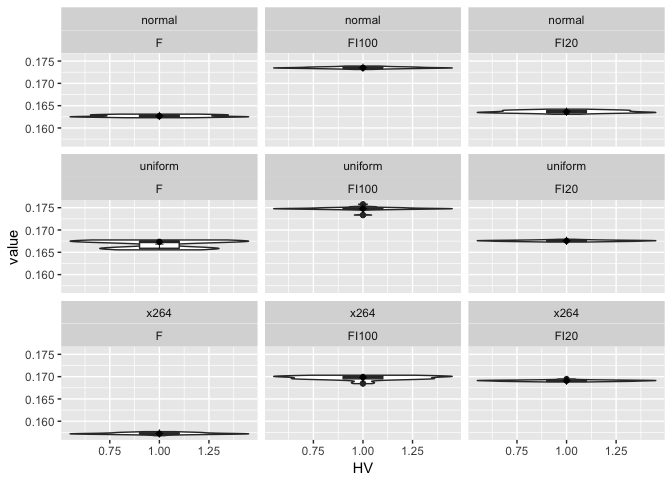

``` {.r}
ggplot(na.omit(subset(DATA, VARIABLE=="PCORRECT")), aes(y=value, x = 1)) +
    geom_violin() + geom_boxplot(width = 0.2) +
        facet_wrap(DIST ~ OBJ, ncol = 3, drop = TRUE) +
            stat_summary(fun.y="median", geom="point") +
                stat_summary(fun.y="mean", geom="point", shape=3) + xlab("PCORRECT")
```

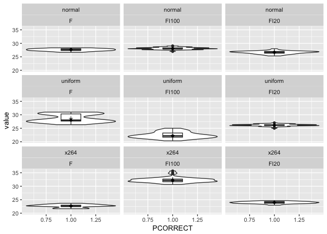

``` {.r}
ggplot(na.omit(subset(DATA, VARIABLE=="TimeToAnyC")), aes(y=value, x = 1)) +
    geom_violin() + geom_boxplot(width = 0.2) +
        facet_wrap(DIST ~ OBJ, ncol = 3, drop = TRUE) +
            stat_summary(fun.y="median", geom="point") +
                stat_summary(fun.y="mean", geom="point", shape=3) + xlab("TimeToAnyC")
```


### ALGO=NSGAII

``` {.r}
DATA <- subset(df.toybox, ALGO == "NSGAII" & OBJ %in% c("F","FI20","FI100"))
```

``` {.r}
acast(DATA, DIST ~ OBJ, length)
```

    ##           F FI100 FI20
    ## normal  200   200  200
    ## uniform 200   200  200
    ## x264    200   200  200

``` {.r}
ggplot(na.omit(subset(DATA, VARIABLE=="HV")), aes(y=value, x = 1)) +
    geom_violin() + geom_boxplot(width = 0.2) +
        facet_wrap(DIST ~ OBJ, ncol = 3, drop = TRUE) +
            stat_summary(fun.y="median", geom="point") +
                stat_summary(fun.y="mean", geom="point", shape=3) + xlab("HV")
```

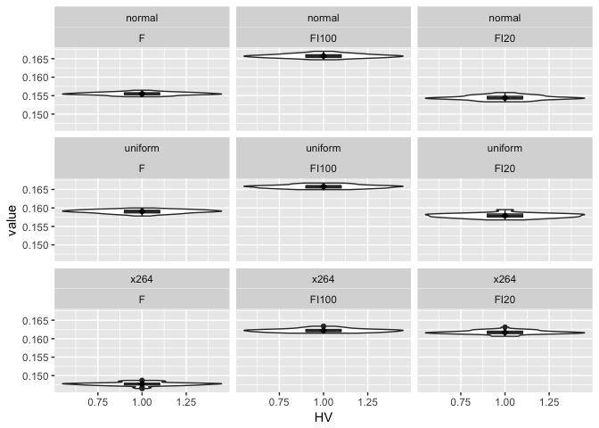

``` {.r}
ggplot(na.omit(subset(DATA, VARIABLE=="PCORRECT" & value < 1000)), aes(y=value, x = 1)) +
    geom_violin() + geom_boxplot(width = 0.2) +
        facet_wrap(DIST ~ OBJ, ncol = 3, drop = TRUE) +
            stat_summary(fun.y="median", geom="point") +
                stat_summary(fun.y="mean", geom="point", shape=3) + xlab("PCORRECT")
```


``` {.r}
ggplot(na.omit(subset(DATA, VARIABLE=="TimeToAnyC" & value < 50000)), aes(y=value, x = 1)) +
    geom_violin() + geom_boxplot(width = 0.2) +
        facet_wrap(DIST ~ OBJ, ncol = 3, drop = TRUE) +
            stat_summary(fun.y="median", geom="point") +
                stat_summary(fun.y="mean", geom="point", shape=3) + xlab("TimeToAnyC")
```

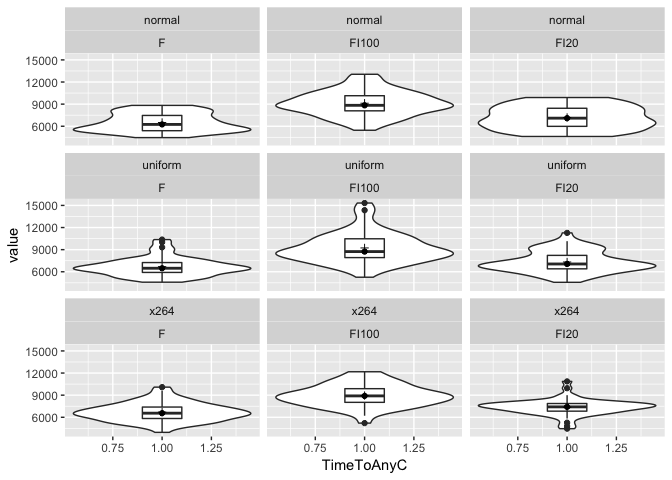

Analysis of variances (for ALGO = IBEA)
=======================================

``` {.r}
DATA <- subset(df.toybox, ALGO == "IBEA" & OBJ %in% c("F","FI100") & DIST %in% c("normal","x264"))
d.hv.glm <- glm(value ~ OBJ * DIST, family = gaussian, data = subset(DATA, VARIABLE == "HV"))
d.pc.glm <- glm(value ~ OBJ * DIST, family = gaussian, data = subset(DATA, VARIABLE == "PCORRECT"))
```

### Checks

#### Normality of residuals

``` {.r}
hv.res <- residuals(d.hv.glm)
QQplot(hv.res)
```


``` {.r}
pc.res <- residuals(d.pc.glm)
QQplot(pc.res)
```

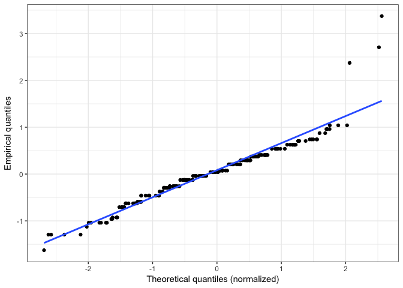

#### Homogeneity of variances

``` {.r}
hv <- subset(DATA, VARIABLE == "HV")
hv$combn <- interaction(hv$OBJ,hv$DIST)
pc <- subset(DATA, VARIABLE == "PCORRECT")
pc$combn <- interaction(pc$OBJ,pc$DIST)

ggplot(data=hv, aes(y = value, x = 1)) + geom_boxplot() + facet_wrap(~ combn, nrow=1) + theme_bw()
```

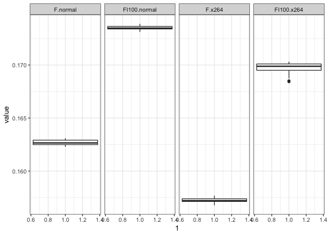

``` {.r}
ggplot(data=pc, aes(y = value, x = 1)) + geom_boxplot() + facet_wrap(~ combn, nrow=1) + theme_bw()
```

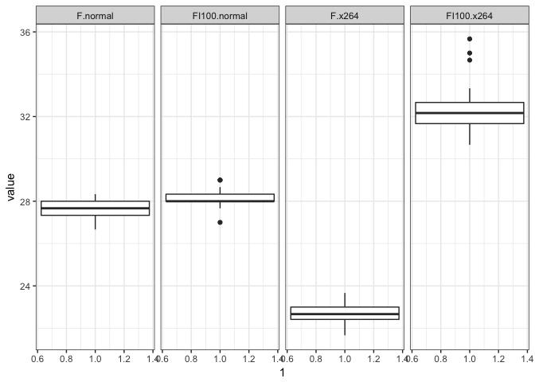

``` {.r}
l.test <- cbind(as.numeric(leveneTest(value ~ OBJ * DIST, data = hv)[1,]),
      as.numeric(leveneTest(value ~ OBJ * DIST, data = hv, center = mean)[1,]),
                as.numeric(leveneTest(value ~ OBJ * DIST, data = pc)[1,]),
      as.numeric(leveneTest(value ~ OBJ * DIST, data = pc, center = mean)[1,]))

colnames(l.test) <- c("median","mean","median","mean")
rownames(l.test) <- c("Df", "F", "p-value")
pander(l.test)
```

<table>
<colgroup>
<col width="19%" />
<col width="13%" />
<col width="13%" />
<col width="13%" />
<col width="13%" />
</colgroup>
<thead>
<tr class="header">
<th align="center"> </th>
<th align="center">median</th>
<th align="center">mean</th>
<th align="center">median</th>
<th align="center">mean</th>
</tr>
</thead>
<tbody>
<tr class="odd">
<td align="center"><strong>Df</strong></td>
<td align="center">3</td>
<td align="center">3</td>
<td align="center">3</td>
<td align="center">3</td>
</tr>
<tr class="even">
<td align="center"><strong>F</strong></td>
<td align="center">13.91</td>
<td align="center">19.12</td>
<td align="center">8.145</td>
<td align="center">8.264</td>
</tr>
<tr class="odd">
<td align="center"><strong>p-value</strong></td>
<td align="center">2.924e-08</td>
<td align="center">6.467e-11</td>
<td align="center">3.874e-05</td>
<td align="center">3.328e-05</td>
</tr>
</tbody>
</table>

### Anova table: Hypervolume (HV)

``` {.r}
ggplot(na.omit(subset(DATA, VARIABLE == "HV")), aes(y=value, x = 1)) +
    geom_violin() + geom_boxplot(width = 0.2) +
        facet_wrap(DIST ~ OBJ, ncol = 2, drop = TRUE) +
            stat_summary(fun.y="median", geom="point") +
                stat_summary(fun.y="mean", geom="point", shape=3) + xlab("HV")
```

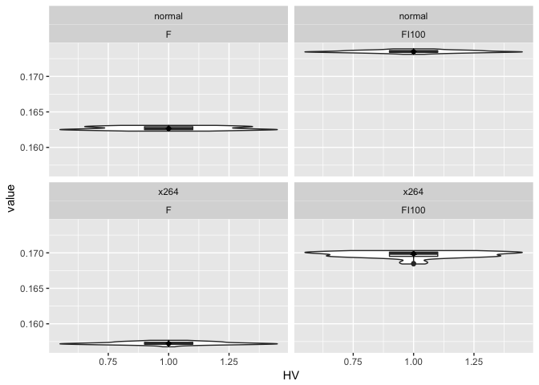

``` {.r}
panderOptions('digits', 4)
## panderOptions('round', 4)
panderOptions('keep.trailing.zeros', TRUE)
pander(anova(d.hv.glm, test = "F"))
```

<table>
<caption>Analysis of Deviance Table</caption>
<colgroup>
<col width="20%" />
<col width="6%" />
<col width="15%" />
<col width="16%" />
<col width="18%" />
<col width="8%" />
<col width="13%" />
</colgroup>
<thead>
<tr class="header">
<th align="center"> </th>
<th align="center">Df</th>
<th align="center">Deviance</th>
<th align="center">Resid. Df</th>
<th align="center">Resid. Dev</th>
<th align="center">F</th>
<th align="center">Pr(&gt;F)</th>
</tr>
</thead>
<tbody>
<tr class="odd">
<td align="center"><strong>NULL</strong></td>
<td align="center">NA</td>
<td align="center">NA</td>
<td align="center">199</td>
<td align="center">0.0079</td>
<td align="center">NA</td>
<td align="center">NA</td>
</tr>
<tr class="even">
<td align="center"><strong>OBJ</strong></td>
<td align="center">1</td>
<td align="center">0.00679</td>
<td align="center">198</td>
<td align="center">0.00111</td>
<td align="center">81544</td>
<td align="center">9.51e-259</td>
</tr>
<tr class="odd">
<td align="center"><strong>DIST</strong></td>
<td align="center">1</td>
<td align="center">0.001059</td>
<td align="center">197</td>
<td align="center">5.159e-05</td>
<td align="center">12714</td>
<td align="center">3.371e-180</td>
</tr>
<tr class="even">
<td align="center"><strong>OBJ:DIST</strong></td>
<td align="center">1</td>
<td align="center">3.527e-05</td>
<td align="center">196</td>
<td align="center">1.632e-05</td>
<td align="center">423.5</td>
<td align="center">7.173e-51</td>
</tr>
</tbody>
</table>

``` {.r}
pander(aov(value ~ OBJ * DIST, data = droplevels(subset(DATA, VARIABLE == "HV"))))
```

<table>
<caption>Analysis of Variance Model</caption>
<colgroup>
<col width="22%" />
<col width="6%" />
<col width="13%" />
<col width="13%" />
<col width="13%" />
<col width="13%" />
</colgroup>
<thead>
<tr class="header">
<th align="center"> </th>
<th align="center">Df</th>
<th align="center">Sum Sq</th>
<th align="center">Mean Sq</th>
<th align="center">F value</th>
<th align="center">Pr(&gt;F)</th>
</tr>
</thead>
<tbody>
<tr class="odd">
<td align="center"><strong>OBJ</strong></td>
<td align="center">1</td>
<td align="center">0.00679</td>
<td align="center">0.00679</td>
<td align="center">81544</td>
<td align="center">9.51e-259</td>
</tr>
<tr class="even">
<td align="center"><strong>DIST</strong></td>
<td align="center">1</td>
<td align="center">0.001059</td>
<td align="center">0.001059</td>
<td align="center">12714</td>
<td align="center">3.371e-180</td>
</tr>
<tr class="odd">
<td align="center"><strong>OBJ:DIST</strong></td>
<td align="center">1</td>
<td align="center">3.527e-05</td>
<td align="center">3.527e-05</td>
<td align="center">423.5</td>
<td align="center">7.173e-51</td>
</tr>
<tr class="even">
<td align="center"><strong>Residuals</strong></td>
<td align="center">196</td>
<td align="center">1.632e-05</td>
<td align="center">8.327e-08</td>
<td align="center">NA</td>
<td align="center">NA</td>
</tr>
</tbody>
</table>

``` {.r}
my.interactionPlot(subset(DATA, VARIABLE == "HV"))
```

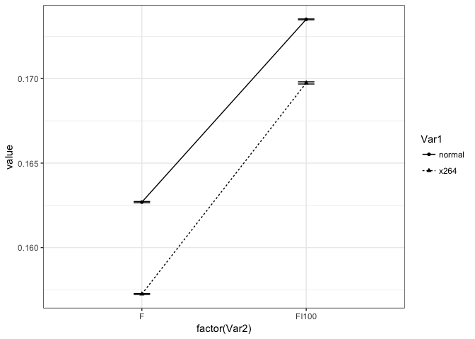

``` {.r}
my.nestedBoxplot(subset(DATA, VARIABLE == "HV"))
```

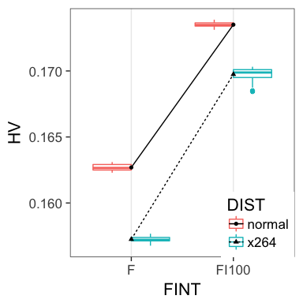

### Anova table: PCORRECT

``` {.r}
d.pc.glm <- glm(value ~ OBJ * DIST, family = gaussian, data = subset(DATA, VARIABLE == "PCORRECT"))

ggplot(na.omit(subset(DATA, VARIABLE == "PCORRECT")), aes(y=value, x = 1)) +
    geom_violin() + geom_boxplot(width = 0.2) +
        facet_wrap(DIST ~ OBJ, ncol = 2, drop = TRUE) +
            stat_summary(fun.y="median", geom="point") +
                stat_summary(fun.y="mean", geom="point", shape=3) + xlab("PCORRECT")
```


``` {.r}
pander(anova(d.pc.glm, test = "F"))
```

<table>
<caption>Analysis of Deviance Table</caption>
<colgroup>
<col width="20%" />
<col width="6%" />
<col width="15%" />
<col width="16%" />
<col width="18%" />
<col width="8%" />
<col width="13%" />
</colgroup>
<thead>
<tr class="header">
<th align="center"> </th>
<th align="center">Df</th>
<th align="center">Deviance</th>
<th align="center">Resid. Df</th>
<th align="center">Resid. Dev</th>
<th align="center">F</th>
<th align="center">Pr(&gt;F)</th>
</tr>
</thead>
<tbody>
<tr class="odd">
<td align="center"><strong>NULL</strong></td>
<td align="center">NA</td>
<td align="center">NA</td>
<td align="center">199</td>
<td align="center">2392</td>
<td align="center">NA</td>
<td align="center">NA</td>
</tr>
<tr class="even">
<td align="center"><strong>OBJ</strong></td>
<td align="center">1</td>
<td align="center">1280</td>
<td align="center">198</td>
<td align="center">1112</td>
<td align="center">3098</td>
<td align="center">4.697e-122</td>
</tr>
<tr class="odd">
<td align="center"><strong>DIST</strong></td>
<td align="center">1</td>
<td align="center">6.48</td>
<td align="center">197</td>
<td align="center">1106</td>
<td align="center">15.68</td>
<td align="center">0.0001048</td>
</tr>
<tr class="even">
<td align="center"><strong>OBJ:DIST</strong></td>
<td align="center">1</td>
<td align="center">1025</td>
<td align="center">196</td>
<td align="center">80.99</td>
<td align="center">2479</td>
<td align="center">3.378e-113</td>
</tr>
</tbody>
</table>

``` {.r}
pander(aov(value ~ OBJ * DIST, data = droplevels(subset(DATA, VARIABLE == "PCORRECT"))))
```

<table>
<caption>Analysis of Variance Model</caption>
<colgroup>
<col width="22%" />
<col width="6%" />
<col width="12%" />
<col width="13%" />
<col width="13%" />
<col width="13%" />
</colgroup>
<thead>
<tr class="header">
<th align="center"> </th>
<th align="center">Df</th>
<th align="center">Sum Sq</th>
<th align="center">Mean Sq</th>
<th align="center">F value</th>
<th align="center">Pr(&gt;F)</th>
</tr>
</thead>
<tbody>
<tr class="odd">
<td align="center"><strong>OBJ</strong></td>
<td align="center">1</td>
<td align="center">1280</td>
<td align="center">1280</td>
<td align="center">3098</td>
<td align="center">4.697e-122</td>
</tr>
<tr class="even">
<td align="center"><strong>DIST</strong></td>
<td align="center">1</td>
<td align="center">6.48</td>
<td align="center">6.48</td>
<td align="center">15.68</td>
<td align="center">0.0001048</td>
</tr>
<tr class="odd">
<td align="center"><strong>OBJ:DIST</strong></td>
<td align="center">1</td>
<td align="center">1025</td>
<td align="center">1025</td>
<td align="center">2479</td>
<td align="center">3.378e-113</td>
</tr>
<tr class="even">
<td align="center"><strong>Residuals</strong></td>
<td align="center">196</td>
<td align="center">80.99</td>
<td align="center">0.4132</td>
<td align="center">NA</td>
<td align="center">NA</td>
</tr>
</tbody>
</table>

``` {.r}
my.interactionPlot(subset(DATA, VARIABLE == "PCORRECT"))
```

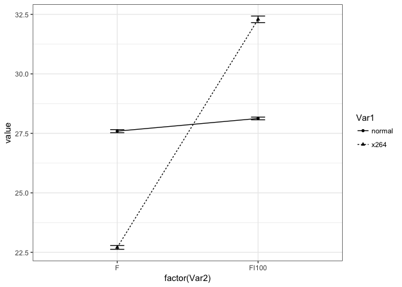

``` {.r}
my.nestedBoxplot(subset(DATA, VARIABLE == "PCORRECT"))
```

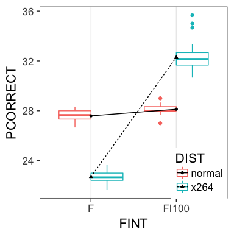

### Significant differences: Tukey HSD

``` {.r}
hsd.pc <- TukeyHSD(aov(value ~ OBJ * DIST, data = droplevels(subset(DATA, VARIABLE == "HV"))))
pander(hsd.pc$`OBJ:DIST`)
```

<table>
<colgroup>
<col width="41%" />
<col width="13%" />
<col width="13%" />
<col width="13%" />
<col width="13%" />
</colgroup>
<thead>
<tr class="header">
<th align="center"> </th>
<th align="center">diff</th>
<th align="center">lwr</th>
<th align="center">upr</th>
<th align="center">p adj</th>
</tr>
</thead>
<tbody>
<tr class="odd">
<td align="center"><strong>FI100:normal-F:normal</strong></td>
<td align="center">0.01081</td>
<td align="center">0.01066</td>
<td align="center">0.01096</td>
<td align="center">7.572e-14</td>
</tr>
<tr class="even">
<td align="center"><strong>F:x264-F:normal</strong></td>
<td align="center">-0.005441</td>
<td align="center">-0.005591</td>
<td align="center">-0.005292</td>
<td align="center">7.572e-14</td>
</tr>
<tr class="odd">
<td align="center"><strong>FI100:x264-F:normal</strong></td>
<td align="center">0.007052</td>
<td align="center">0.006902</td>
<td align="center">0.007201</td>
<td align="center">7.572e-14</td>
</tr>
<tr class="even">
<td align="center"><strong>F:x264-FI100:normal</strong></td>
<td align="center">-0.01625</td>
<td align="center">-0.0164</td>
<td align="center">-0.01611</td>
<td align="center">7.572e-14</td>
</tr>
<tr class="odd">
<td align="center"><strong>FI100:x264-FI100:normal</strong></td>
<td align="center">-0.003762</td>
<td align="center">-0.003911</td>
<td align="center">-0.003612</td>
<td align="center">7.572e-14</td>
</tr>
<tr class="even">
<td align="center"><strong>FI100:x264-F:x264</strong></td>
<td align="center">0.01249</td>
<td align="center">0.01234</td>
<td align="center">0.01264</td>
<td align="center">7.572e-14</td>
</tr>
</tbody>
</table>

``` {.r}
hsd.pc <- TukeyHSD(aov(value ~ OBJ * DIST, data = droplevels(subset(DATA, VARIABLE == "PCORRECT"))))
pander(hsd.pc$`OBJ:DIST`)
```

<table>
<colgroup>
<col width="41%" />
<col width="9%" />
<col width="9%" />
<col width="9%" />
<col width="12%" />
</colgroup>
<thead>
<tr class="header">
<th align="center"> </th>
<th align="center">diff</th>
<th align="center">lwr</th>
<th align="center">upr</th>
<th align="center">p adj</th>
</tr>
</thead>
<tbody>
<tr class="odd">
<td align="center"><strong>FI100:normal-F:normal</strong></td>
<td align="center">0.5333</td>
<td align="center">0.2002</td>
<td align="center">0.8665</td>
<td align="center">0.0002894</td>
</tr>
<tr class="even">
<td align="center"><strong>F:x264-F:normal</strong></td>
<td align="center">-4.887</td>
<td align="center">-5.22</td>
<td align="center">-4.554</td>
<td align="center">7.572e-14</td>
</tr>
<tr class="odd">
<td align="center"><strong>FI100:x264-F:normal</strong></td>
<td align="center">4.7</td>
<td align="center">4.367</td>
<td align="center">5.033</td>
<td align="center">7.572e-14</td>
</tr>
<tr class="even">
<td align="center"><strong>F:x264-FI100:normal</strong></td>
<td align="center">-5.42</td>
<td align="center">-5.753</td>
<td align="center">-5.087</td>
<td align="center">7.572e-14</td>
</tr>
<tr class="odd">
<td align="center"><strong>FI100:x264-FI100:normal</strong></td>
<td align="center">4.167</td>
<td align="center">3.834</td>
<td align="center">4.5</td>
<td align="center">7.572e-14</td>
</tr>
<tr class="even">
<td align="center"><strong>FI100:x264-F:x264</strong></td>
<td align="center">9.587</td>
<td align="center">9.254</td>
<td align="center">9.92</td>
<td align="center">7.572e-14</td>
</tr>
</tbody>
</table>

Exact Replication
=================

``` {.r}
acast(df.ase13, VARIABLE ~ ALGO, length)
```

    ##            IBEA NSGAII
    ## HV           50     50
    ## PCORRECT     50     50
    ## TimeTo50C    50     50
    ## TimeToAnyC   50     50

``` {.r}
ggplot(na.omit(subset(df.ase13, VARIABLE=="HV")), aes(y=value, x = 1)) +
    geom_violin() + geom_boxplot(width = 0.2) +
        facet_wrap( ~ ALGO, ncol = 2, drop = FALSE) +
            stat_summary(fun.y="median", geom="point") +
                stat_summary(fun.y="mean", geom="point", shape=3) + xlab("HV")
```

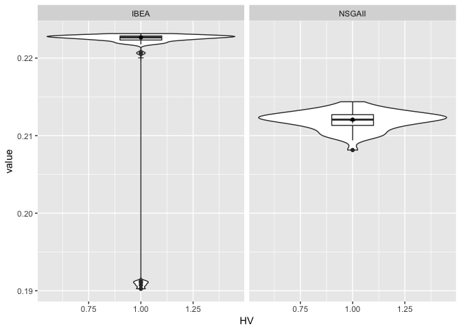

``` {.r}
ggplot(na.omit(subset(df.ase13, VARIABLE=="PCORRECT")), aes(y=value, x = 1)) +
    geom_violin() + geom_boxplot(width = 0.2) +
        facet_wrap( ~ ALGO, ncol = 2, drop = FALSE) +
            stat_summary(fun.y="median", geom="point") +
                stat_summary(fun.y="mean", geom="point", shape=3) + xlab("PCORRECT")
```

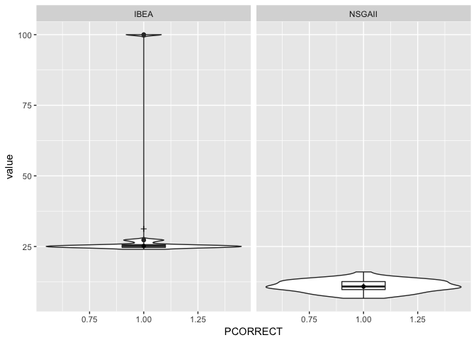

``` {.r}
ggplot(na.omit(subset(df.ase13, VARIABLE=="TimeTo50C")), aes(y=value, x = 1)) +
    geom_violin() + geom_boxplot(width = 0.2) +
        facet_wrap( ~ ALGO, ncol = 2, drop = FALSE) +
            stat_summary(fun.y="median", geom="point") +
                stat_summary(fun.y="mean", geom="point", shape=3) + xlab("TimeTo50C")
```

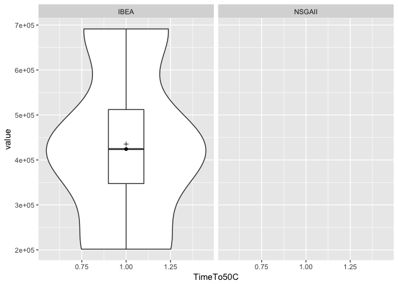

``` {.r}
ggplot(na.omit(subset(df.ase13, VARIABLE=="TimeToAnyC")), aes(y=value, x = 1)) +
    geom_violin() + geom_boxplot(width = 0.2) +
        facet_wrap( ~ ALGO, ncol = 2, drop = FALSE) +
            stat_summary(fun.y="median", geom="point") +
                stat_summary(fun.y="mean", geom="point", shape=3) + xlab("TimeToAnyC")
```

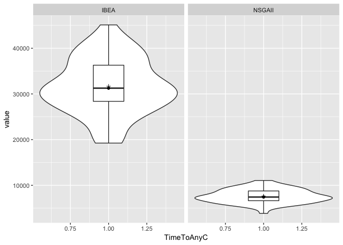

``` {.r}
tmp.mean <- dcast(na.omit(subset(df.ase13, VARIABLE != "TimeTo50C")), VARIABLE ~ ALGO, mean)
tmp.sd <- dcast(na.omit(subset(df.ase13, VARIABLE != "TimeTo50C")), VARIABLE ~ ALGO, sd)
tmp.median <- dcast(na.omit(subset(df.ase13, VARIABLE != "TimeTo50C")), VARIABLE ~ ALGO, median)
tmp.mad <- dcast(na.omit(subset(df.ase13, VARIABLE != "TimeTo50C")), VARIABLE ~ ALGO, mad)
tmp.min <- suppressWarnings(dcast(na.omit(subset(df.ase13, VARIABLE != "TimeTo50C")), VARIABLE ~ ALGO, min))
tmp.max <- suppressWarnings(dcast(na.omit(subset(df.ase13, VARIABLE != "TimeTo50C")), VARIABLE ~ ALGO, max))
knitr::kable(cbind(tmp.mean, tmp.sd[,2:3], tmp.median[,2:3], tmp.mad[,2:3], tmp.min[,2:3], tmp.max[,2:3]), format = "markdown", digits=4)
```

|VARIABLE|IBEA|NSGAII|IBEA|NSGAII|IBEA|NSGAII|IBEA|NSGAII|IBEA|NSGAII|IBEA|NSGAII|
|:-------|---:|-----:|---:|-----:|---:|-----:|---:|-----:|---:|-----:|---:|-----:|
|HV|0.2200|0.2119|0.0087|0.0013|0.2227|0.2121|0.0004|0.0011|0.1903|0.2081|0.2232|0.2144|
|PCORRECT|31.2533|10.9800|20.4951|2.0989|25.1667|10.8333|0.7413|2.2239|24.0000|6.6667|100.0000|16.0000|
|TimeToAnyC|31687.1200|7642.1200|6073.7676|1510.4444|31263.5000|7436.5000|6621.2916|1729.4529|19241.0000|3855.0000|45109.0000|11058.0000|

Exact vs. adjusted replication
==============================

``` {.r}
df.contr <- rbind(cbind(df.ase13, EXP="exact"),
     cbind(subset(df.toybox, OBJ == "F" & DIST == "normal"), EXP="adjusted"))
acast(df.contr, EXP ~ ALGO, length)
```

    ##          IBEA NSGAII
    ## exact     200    200
    ## adjusted  200    200

``` {.r}
ggplot(na.omit(subset(df.contr, VARIABLE=="HV")), aes(y=value, x = 1)) +
    geom_violin() + geom_boxplot(width = 0.2) +
        facet_wrap(EXP ~ ALGO, ncol = 2, drop = FALSE) +
            stat_summary(fun.y="median", geom="point") +
                stat_summary(fun.y="mean", geom="point", shape=3) + xlab("HV")
```

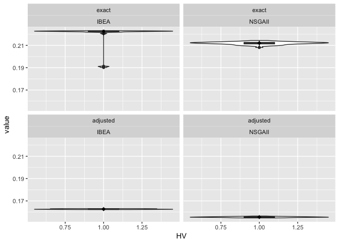

``` {.r}
ggplot(na.omit(subset(df.contr, VARIABLE=="PCORRECT")), aes(y=value, x = 1)) +
    geom_violin() + geom_boxplot(width = 0.2) +
        facet_wrap(EXP ~ ALGO, ncol = 2, drop = FALSE) +
            stat_summary(fun.y="median", geom="point") +
                stat_summary(fun.y="mean", geom="point", shape=3) + xlab("PCORRECT")
```

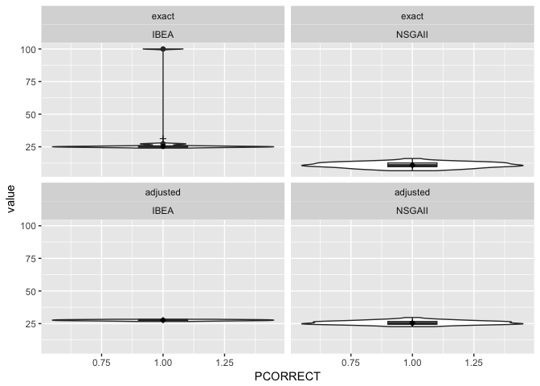

Detach R packages
=================

``` {.r}
try(detach(package:ggplot2))
try(detach(package:reshape2))
try(detach(package:car))
try(detach(package:pander))
```
